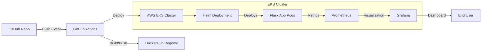

# ☁️ Cloud DevOps Pipeline on AWS EKS

A **production-grade CI/CD pipeline** built using GitHub Actions, Terraform, AWS EKS, Helm, and Docker—deploying a Python Flask microservice with observability and monitoring support.

> 🔧 Built for DevOps/SRE interviews, cloud engineering showcase, and real-world infrastructure demos.

[](https://opensource.org/licenses/MIT)
[](https://www.terraform.io/)
[](https://kubernetes.io/)

---

## 🚀 Project Summary

This project demonstrates a complete cloud-native DevOps setup that includes:

- ✅ GitOps-based CI/CD with GitHub Actions  
- ✅ Infrastructure provisioning with Terraform  
- ✅ Containerized Flask app with Docker  
- ✅ Kubernetes deployment via Helm on EKS  
- ✅ Prometheus + Grafana for observability  
- ✅ Secure and scalable microservice delivery  

---

## 🧱 Stack Overview

| Layer               | Tech Stack                             |
|---------------------|----------------------------------------|
| **Application**     | Python Flask                           |
| **Containerization**| Docker                                 |
| **CI/CD**           | GitHub Actions                         |
| **Infrastructure**  | AWS EKS, Terraform                     |
| **Orchestration**   | Kubernetes, Helm                       |
| **Monitoring**      | Prometheus, Grafana                    |

---

## 📸 Architecture


---

## 📁 Folder Structure
```bash
cloud-devops-eks-pipeline/
├── app/                   # Flask app with Dockerfile
│   ├── app.py
│   ├── requirements.txt
│   └── Dockerfile
├── terraform/             # Terraform for EKS cluster
│   ├── main.tf
│   ├── variables.tf
│   └── outputs.tf
├── helm-chart/            # Helm deployment for the app
│   ├── Chart.yaml
│   ├── values.yaml
│   └── templates/
│       ├── deployment.yaml
│       └── service.yaml
├── .github/workflows/     # GitHub Actions CI/CD pipeline
│   └── ci-cd.yml
├── monitoring/            # Prometheus + Grafana configs
├── architecture.png       # System diagram
└── README.md              # Project documentation
```

##🐍 Flask App Overview
```python
from flask import Flask
app = Flask(__name__)

@app.route('/')
def home():
    return "Hello from Flask on EKS!"
```

##⚙️ CI/CD Pipeline (GitHub Actions)

Location: .github/workflows/ci-cd.yml

Workflow Steps:

- 🛠 Checkout code
- 🐳 Build & push Docker image to DockerHub
- ☁️ Configure AWS credentials & kubeconfig
- 📦 Deploy to EKS using Helm

Required GitHub Secrets:

- DOCKER_USERNAME
- DOCKER_PASSWORD
- AWS_ACCESS_KEY_ID
- AWS_SECRET_ACCESS_KEY

Example workflow file:

```yaml
name: CI/CD Pipeline

on:
  push:
    branches: [ main ]

jobs:
  build-and-deploy:
    runs-on: ubuntu-latest
    steps:
    - name: Checkout
      uses: actions/checkout@v4

    - name: Docker Login
      uses: docker/login-action@v2
      with:
        username: ${{ secrets.DOCKER_USERNAME }}
        password: ${{ secrets.DOCKER_PASSWORD }}

    - name: Build and Push
      run: |
        cd app
        docker build -t ${{ secrets.DOCKER_USERNAME }}/flask-app:$GITHUB_SHA .
        docker push ${{ secrets.DOCKER_USERNAME }}/flask-app:$GITHUB_SHA

    - name: Configure AWS
      uses: aws-actions/configure-aws-credentials@v2
      with:
        aws-access-key-id: ${{ secrets.AWS_ACCESS_KEY_ID }}
        aws-secret-access-key: ${{ secrets.AWS_SECRET_ACCESS_KEY }}
        aws-region: us-east-1

    - name: Deploy to EKS
      run: |
        aws eks update-kubeconfig --name my-eks-cluster
        helm upgrade --install flask-app ./helm-chart \
          --set image.repository=${{ secrets.DOCKER_USERNAME }}/flask-app \
          --set image.tag=$GITHUB_SHA
```


