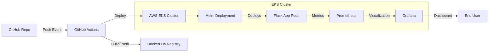

# ☁️ Cloud DevOps Pipeline on AWS EKS

A **production-grade CI/CD pipeline** built using GitHub Actions, Terraform, AWS EKS, Helm, and Docker—deploying a Python Flask microservice with observability and monitoring support.

> 🔧 Built for DevOps/SRE interviews, cloud engineering showcase, and real-world infrastructure demos.

[](https://opensource.org/licenses/MIT)
[](https://www.terraform.io/)
[](https://kubernetes.io/)

---

## 🚀 Project Summary

This project demonstrates a complete cloud-native DevOps setup that includes:

- ✅ GitOps-based CI/CD with GitHub Actions  
- ✅ Infrastructure provisioning with Terraform  
- ✅ Containerized Flask app with Docker  
- ✅ Kubernetes deployment via Helm on EKS  
- ✅ Prometheus + Grafana for observability  
- ✅ Secure and scalable microservice delivery  

---

## 🧱 Stack Overview

| Layer               | Tech Stack                             |
|---------------------|----------------------------------------|
| **Application**     | Python Flask                           |
| **Containerization**| Docker                                 |
| **CI/CD**           | GitHub Actions                         |
| **Infrastructure**  | AWS EKS, Terraform                     |
| **Orchestration**   | Kubernetes, Helm                       |
| **Monitoring**      | Prometheus, Grafana                    |

---

## 📸 Architecture


---

## 📁 Folder Structure
```bash
cloud-devops-eks-pipeline/
├── app/                   # Flask app with Dockerfile
│   ├── app.py
│   ├── requirements.txt
│   └── Dockerfile
├── terraform/             # Terraform for EKS cluster
│   ├── main.tf
│   ├── variables.tf
│   └── outputs.tf
├── helm-chart/            # Helm deployment for the app
│   ├── Chart.yaml
│   ├── values.yaml
│   └── templates/
│       ├── deployment.yaml
│       └── service.yaml
├── .github/workflows/     # GitHub Actions CI/CD pipeline
│   └── ci-cd.yml
├── monitoring/            # Prometheus + Grafana configs
├── architecture.png       # System diagram
└── README.md              # Project documentation
```
---

## 🐍 Flask App Overview
```python
from flask import Flask
app = Flask(__name__)

@app.route('/')
def home():
    return "Hello from Flask on EKS!"
```
---

## ⚙️ CI/CD Pipeline (GitHub Actions)

Location: .github/workflows/ci-cd.yml

Workflow Steps:

- 🛠 Checkout code
- 🐳 Build & push Docker image to DockerHub
- ☁️ Configure AWS credentials & kubeconfig
- 📦 Deploy to EKS using Helm

Required GitHub Secrets:

- DOCKER_USERNAME
- DOCKER_PASSWORD
- AWS_ACCESS_KEY_ID
- AWS_SECRET_ACCESS_KEY

Example workflow file:

```yaml
name: CI/CD Pipeline

on:
  push:
    branches: [ main ]

jobs:
  build-and-deploy:
    runs-on: ubuntu-latest
    steps:
    - name: Checkout
      uses: actions/checkout@v4

    - name: Docker Login
      uses: docker/login-action@v2
      with:
        username: ${{ secrets.DOCKER_USERNAME }}
        password: ${{ secrets.DOCKER_PASSWORD }}

    - name: Build and Push
      run: |
        cd app
        docker build -t ${{ secrets.DOCKER_USERNAME }}/flask-app:$GITHUB_SHA .
        docker push ${{ secrets.DOCKER_USERNAME }}/flask-app:$GITHUB_SHA

    - name: Configure AWS
      uses: aws-actions/configure-aws-credentials@v2
      with:
        aws-access-key-id: ${{ secrets.AWS_ACCESS_KEY_ID }}
        aws-secret-access-key: ${{ secrets.AWS_SECRET_ACCESS_KEY }}
        aws-region: us-east-1

    - name: Deploy to EKS
      run: |
        aws eks update-kubeconfig --name my-eks-cluster
        helm upgrade --install flask-app ./helm-chart \
          --set image.repository=${{ secrets.DOCKER_USERNAME }}/flask-app \
          --set image.tag=$GITHUB_SHA
```
---

## ☁️ Infrastructure (Terraform)

Terraform config (```terraform/main.tf```) provisions:

- EKS Cluster
- Node Group
- VPC/Subnets
- IAM Roles

Deployment:
```bash
cd terraform
terraform init
terraform apply
```

Example ```main.tf```:
```hcl
provider "aws" {
  region = "us-east-1"
}

module "eks" {
  source  = "terraform-aws-modules/eks/aws"
  version = "~> 19.0"

  cluster_name    = "my-eks-cluster"
  cluster_version = "1.29"

  vpc_id     = "vpc-12345678"
  subnet_ids = ["subnet-12345678", "subnet-87654321"]

  eks_managed_node_groups = {
    default = {
      min_size     = 1
      max_size     = 3
      desired_size = 2
      instance_types = ["t3.medium"]
    }
  }
}
```
Edit variables.tf for your region, VPC ID, and subnet IDs

---

## 📦 Helm Chart

Helm templates the app deployment and service:

```yaml
# helm-chart/values.yaml
replicaCount: 2

image:
  repository: your-dockerhub-username/flask-app
  tag: latest

service:
  type: LoadBalancer
  port: 80
  targetPort: 5000

resources:
  limits:
    cpu: 500m
    memory: 512Mi
  requests:
    cpu: 200m
    memory: 256Mi
```
Installation:
```bash
helm upgrade --install flask-app ./helm-chart
```

---

## 📊 Monitoring (Prometheus + Grafana)

Deployment:
```bash
helm repo add prometheus-community https://prometheus-community.github.io/helm-charts
helm install monitoring prometheus-community/kube-prometheus-stack
kubectl port-forward svc/monitoring-grafana 3000:80
```
Access Grafana at: ```http://localhost:3000```
Default credentials: ```admin / prom-operator```

To get the admin password:

```bash
kubectl get secret monitoring-grafana -o jsonpath="{.data.admin-password}" | base64 --decode
```

---

## 🧪 Local Testing

```bash
cd app
docker build -t flask-app .
docker run -p 5000:5000 flask-app
```
Visit: ```http://localhost:5000```

---

## 🔒 Security Considerations

- GitHub Secrets for all credentials
- No hardcoded passwords or keys
- Least-privilege IAM policies
- Encrypted secrets in Kubernetes
- Regular vulnerability scanning
- Network policies for pod communication
- AWS Security Groups with minimal access

---

## 🔭 Future Enhancements

- NGINX Ingress with TLS (cert-manager)
- Horizontal Pod Autoscaler
- Fluentd/Loki for logging
- GitOps with ArgoCD/Flux
- Canary deployments
- AWS Cost Optimization
- OPA/Gatekeeper policies
- Runtime security with Falco

---

## 👨‍💻 Author

Srustik
Senior DevOps Engineer | SRE | Cloud Enthusiast


